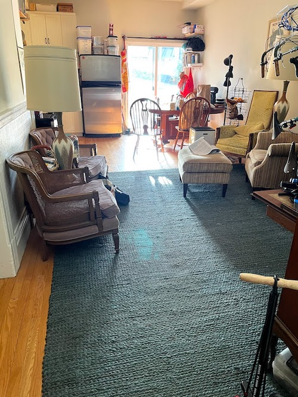

Selling some furniture that doesn't make sense in our new place! All prices negotiable.

1. 9'x12' Heathered Chennile / Jute Rug in Indigo with rug pad. $100

Love this rug, but it doesn't fit color scheme or size wise in our new home. It's a jute rug but a little softer / plusher than most jute rugs. Very durable and easy to clean.

It's this [rug](https://www.potterybarn.com/products/heathered-chenille-jute-rug-natural/) from Pottery Barn, but in a blue color. [Rug pad](https://www.amazon.com/gp/product/B007T58QPA/ref=ppx_yo_dt_b_search_asin_title?ie=UTF8&psc=1) is my favorite felt + latex 1/4 inch thick rug pad that adds quite a bit of cushion while keeping the rug non slip. Retails new for $1000 + shipping.

